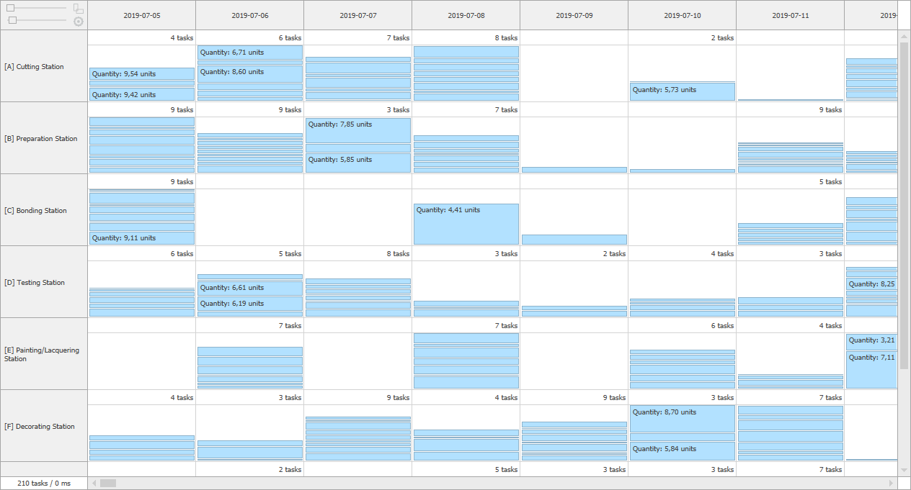

# TagBites.WinSchedulers

Fast and easy customized WPF schedulers controls.

NuGet Package: https://www.nuget.org/packages/TagBites.WinSchedulers/


## TimeScheduler example


To start using the control, all you need is a few lines of code that will define its contents.

```csharp
public class SchedulerDataSource : TimeSchedulerDataSource
{
    public IList<object>[] Resources  { get; }
    public IList<TaskModel> TaskCollection { get; }

    public SchedulerDataSource()
    {
        Resources = GenerateResources();  // TODO Add custom data provider
        TaskCollection = GenerateTasks(); // TODO Add custom data provider
    }


    protected override TimeSchedulerTaskDescriptor CreateTaskDescriptor()
    {
        return new TimeSchedulerTaskDescriptor(typeof(TaskModel), nameof(TaskModel.Resource), nameof(TaskModel.Interval));
    }

    public override IList<object> LoadResources() => Resources;
    public override void LoadContent(TimeSchedulerDataSourceView view)
    {
        foreach (var task in TaskCollection)
            if (view.Interval.IntersectsWith(task.Interval) && view.Resources.Contains(task.Resource))
                view.AddTask(task);
    }
}
```

Full example on github: [TagBites.WinSchedulers-TimeScheduler-Simple](https://github.com/TagBites/TagBites.WinSchedulers-TimeScheduler-Simple).


## BucketScheduler example



```csharp
public class SchedulerDataSource : BucketSchedulerDataSource
{
    public IList<object>[] Rows  { get; }
    public IList<object>[] Columns  { get; }
    public IList<BucketModel> BucketCollection { get; }

    public SchedulerDataSource()
    {
        Rows = GenerateRows();  // TODO Add custom data provider
        Columns = GenerateRows();  // TODO Add custom data provider
        BucketCollection = GenerateBuckets(); // TODO Add custom data provider
    }


    protected override TimeSchedulerTaskDescriptor CreateTaskDescriptor()
    {
        return new TimeSchedulerTaskDescriptor(typeof(TaskModel), nameof(TaskModel.Resource), nameof(TaskModel.Interval));
    }

    public override IList<object> LoadResources() => Resources;
    public override void LoadContent(TimeSchedulerDataSourceView view)
    {
        foreach (var task in TaskCollection)
            if (view.Interval.IntersectsWith(task.Interval) && view.Resources.Contains(task.Resource))
                view.AddTask(task);
    }
}
```

Full example on github: [TagBites.WinSchedulers-BucketScheduler-Simple](https://github.com/TagBites/TagBites.WinSchedulers-BucketScheduler-Simple).
