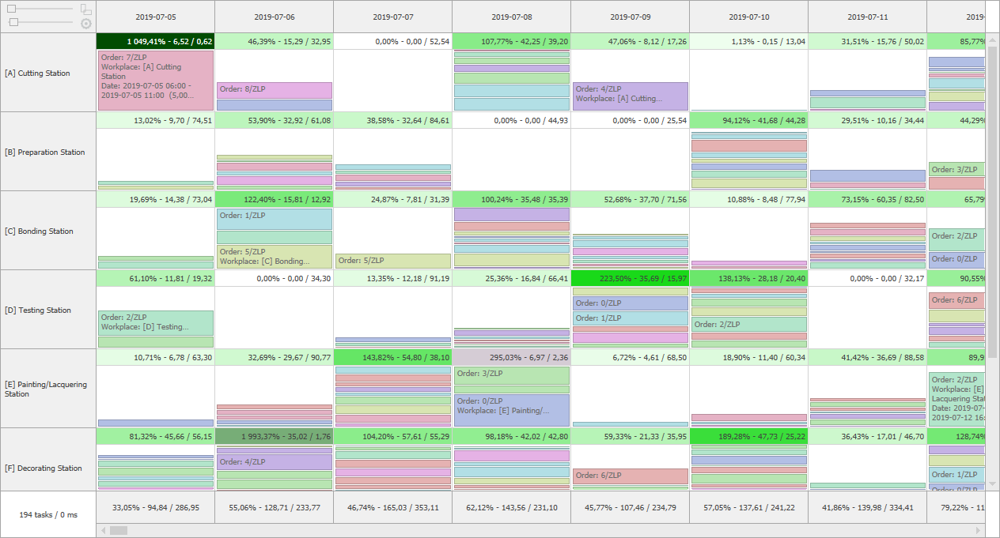
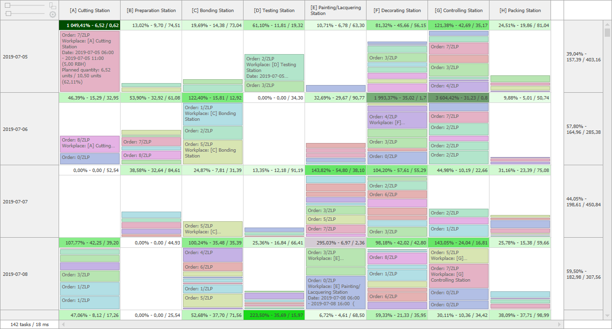

# BucketScheduler

## Data and UI virtualization for performance

Display of thousands of tasks and buckets at a time using Data and UI virtualization with smooth scrolling and responsiveness navigation.


Full example on github: [TagBites.WinSchedulers-BucketScheduler-Performance](https://github.com/TagBites/TagBites.WinSchedulers-BucketScheduler-Performance).

## Powerful data binding and easy integration

The BucketScheduler control uses row, column, summaries, bucket and task descriptors to bind objects of any arbitrary structure to control data. Create a data source class inherited from `BucketSchedulerDataSource` that loads data about the rows, columns and the content of the control.

```csharp
public abstract class MyDataSource : BucketSchedulerDataSource
{
    protected override BucketSchedulerRowColumnDescriptor CreateRowDescriptor() { ... } // Optional
    protected override BucketSchedulerRowColumnDescriptor CreateColumnDescriptor() { ... } // Optional
    protected override BucketSchedulerSummaryDescriptor CreateRowSummaryDescriptor() { ... } // Optional
    protected override BucketSchedulerSummaryDescriptor CreateColumnSummaryDescriptor() { ... } // Optional

    protected override BucketSchedulerBucketDescriptor CreateBucketDescriptor() { ... }
    protected override BucketSchedulerTaskDescriptor CreateTaskDescriptor() { ... }

    public override IList<object> LoadRows() { ... }
    public override IList<object> LoadColumns() { ... }
    public override void LoadContent(BucketSchedulerDataSourceView view) { ... }

    public override void Reset() { ... } // Optional
}
```

## Customization

The control allows you to reflect complex use cases and fully customize its appearance. To meet the exact needs of end users, 
use buckets containing tasks, present data statistics in row and column summaries. Moreover, choose fonts and colors of elements or even change their appearance completely.



Full example on github: [TagBites.WinSchedulers-BucketScheduler-Customization](https://github.com/TagBites/TagBites.WinSchedulers-BucketScheduler-Customization).

## Horizontal or vertical orientation

The BucketScheduler allows you to display content in the horizontal and vertical orientation and smooth switching between them.

