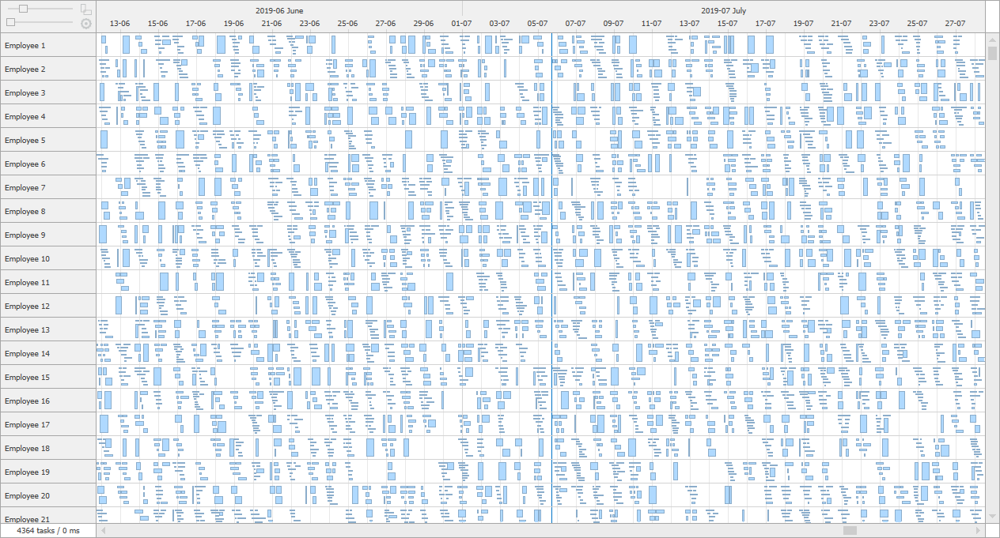
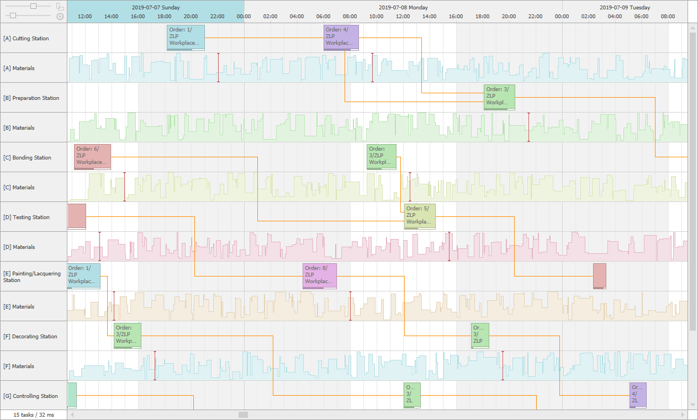

# TimeScheduler

## Data and UI virtualization for performance

Display of thousands of tasks at a time using Data and UI virtualization with smooth scrolling and responsiveness navigation.



Full example on github: [TagBites.WinSchedulers-TimeScheduler-Performance](https://github.com/TagBites/TagBites.WinSchedulers-TimeScheduler-Performance).

## Powerful data binding and easy integration

The TimeScheduler control uses resource and task descriptors to bind objects of any arbitrary structure to control data. Create a data source class inherited from `TimeSchedulerDataSource` that loads data about the resources and the content of the control.

```csharp
public abstract class MyDataSource : TimeSchedulerDataSource
{
    protected override TimeSchedulerResourceDescriptor CreateResourceDescriptor() { ... }
    protected override TimeSchedulerTaskDescriptor CreateTaskDescriptor() { ... }

    public override IList<object> LoadResources() { ... }
    public override void LoadContent(TimeSchedulerDataSourceView view) { ... }

    public override void Reset() { ... } // Optional
}
```

## Customization

The control allows you to reflect complex use cases and fully customize its appearance. To meet the exact needs of end users, use tasks, define the connection between them, set work times, mark important dates using time and interval markers, present numerical data using graphs. Moreover, choose fonts and colors of elements or even change their appearance completely.



Full example on github: [TagBites.WinSchedulers-TimeScheduler-Customization](https://github.com/TagBites/TagBites.WinSchedulers-TimeScheduler-Customization).

## Horizontal or vertical orientation

The TimeScheduler allows you to display content in the horizontal and vertical orientation and smooth switching between them.


